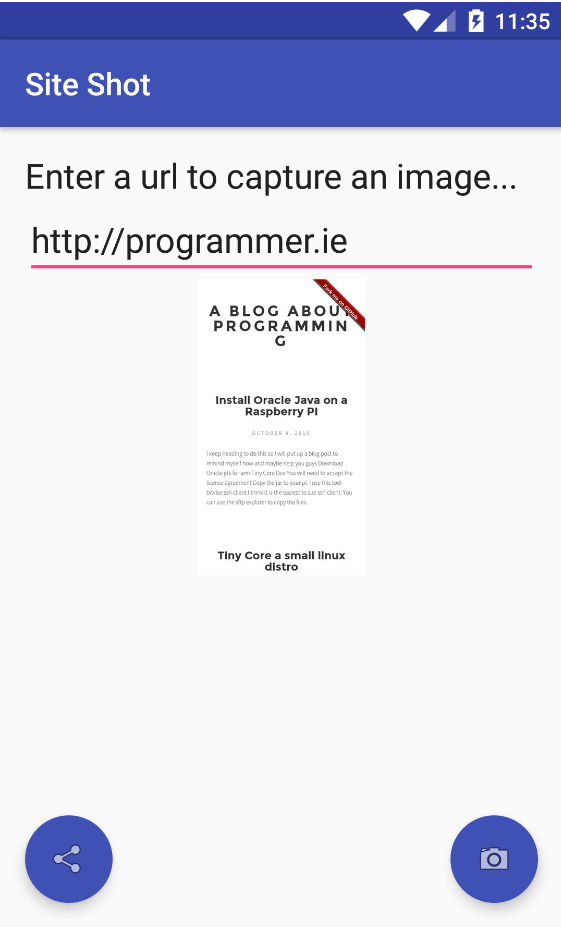

# Site Shot

android implementation of this blog post:

https://shkspr.mobi/blog/2015/11/google-secret-screenshot-api/

It will allow you to enter in a url for a website and will use the google api to take a screen shot of the site.

It will then allow you to share the result.
